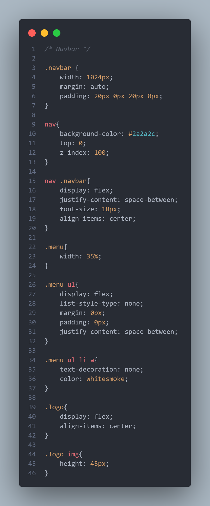
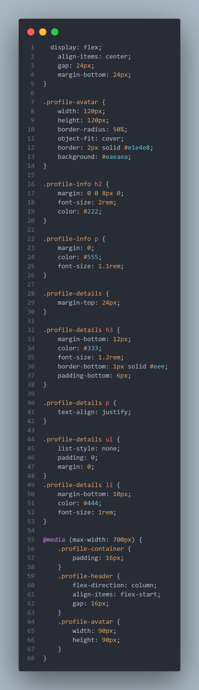

# Laporan Praktikum Membangun Halaman Web Curriculum Vitae dengan HTML dan CSS

Proyek ini merupakan tugas praktikum pada mata kuliah **Pemrograman Web** yang berfokus pada pembuatan layout website menggunakan **HTML5** dan **CSS**.  Website yang dibuat berupa Curriculum Vitae digital sederhana dengan 2 halaman utama, yaitu **Homepage** dan **About**, serta menggunakan file **style.css** sebagai styling eksternal.

## 📌 Tujuan
- Melatih kemampuan membuat struktur halaman web dengan HTML5.  
- Menggunakan elemen semantik seperti `<header>`, `<nav>`, `<section>`, dan `<footer>`.  
- Menerapkan CSS eksternal untuk styling dan mempercantik tampilan.  
- Memahami penggunaan selektor CSS dan konsep Box Model.  

## 👩‍💻 Identitas Praktikan
- **Nama**: Benedito Nidio Da Rosa Maia Tilman  
- **NIM**: 42430032  
- **Dosen Pengampu**: Ir. Gede Humaswara Prathama, S.T., M.T  
- **Program Studi**: Teknologi Informasi, Fakultas Teknik dan Informatika, Universitas Pendidikan Nasional – 2025  

## 🌐 Tema Website
Website *Curriculum Vitae* ini menampilkan informasi pribadi berupa:  
- Biodata diri  
- Riwayat pendidikan  
- Daftar keterampilan & Project telah dibuat (*skills*)  
- Link sosial media  

Website terdiri dari dua halaman utama:  
1. **Homepage**: berisi ringkasan profil dan navigasi menuju halaman lain.  
2. **About**: berisi informasi detail seperti biodata, pendidikan, dan keterampilan.  

Styling keseluruhan diatur dalam file **style.css** untuk menjaga konsistensi tampilan.

## 📄 Struktur Halaman

### 1. Homepage (homepage.html)
Halaman utama yang menampilkan kutipan motivasi sebagai pembuka website.  

**Memiliki:**  
- Navbar di bagian atas berisi logo dan menu navigasi: Home Page, About, dan Contact.  
- Hero Section menampilkan kutipan inspiratif dari *Charlie Munger* untuk memberi kesan pembuka.  
- Contact Section dituju lewat menu navigasi Contact, berisi informasi kontak pengguna.  
- Footer berisi teks hak cipta.  

### Yang dimana tampilanya seperti ini

---

### 2. About (about.html)
Halaman yang berisi detail Curriculum Vitae secara lengkap.  

**Memiliki:**  
- Navbar di bagian atas sama seperti Homepage untuk konsistensi navigasi.  
- Header Profil menampilkan foto, nama lengkap, status sebagai mahasiswa, dan deskripsi singkat.  
- Section About berisi penjelasan diri, ketertarikan di bidang teknologi dan desain, serta fokus sebagai junior web developer.  
- Section Education berisi daftar riwayat pendidikan, mulai dari sekolah hingga universitas.  
- Section Research Interests menampilkan bidang minat seperti Web Development, UI/UX Design, dan Artificial Intelligence.  
- Section Projects menampilkan beberapa proyek yang pernah dibuat, seperti:  
  - Medical Chain ID  
  - Website Portfolio  
  - E-commerce Website  
  - Agency Website  
- Footer berisi link sosial media (Instagram, GitHub, YouTube) serta tombol untuk kembali ke Homepage.  

### Yang dimana tampilanya seperti ini

---

### 3. Styling (style.css)
File CSS eksternal untuk mengatur tampilan kedua halaman.  

**Penjelasan:**  
- Mengatur font, warna, dan tata letak pada seluruh elemen halaman.  
- Navbar diatur agar logo dan menu sejajar menggunakan layout fleksibel.  
- Hero Section diberi efek background overlay agar teks motivasi lebih jelas.  
- About Page diberi gaya visual pada foto profil, biodata, dan daftar proyek.  
- Menggunakan berbagai selektor (kelas, id, atribut, pseudo-class).  
- Menerapkan konsep **Box Model** (margin, padding, border, dan shadow) untuk memberi ruang dan mempercantik tampilan.  

## 📷 Dokumentasi Coding & Penjelasan

`Homepage.html`

## 📌 Penjelasan Navbar (html)

1. `<nav>`  
   - Dipakai untuk menandai area navigasi utama.  
   - **Alasan**: elemen semantik yang jelas memberi tahu browser dan user bahwa bagian ini adalah menu navigasi.  

2. `
`  
   - Wadah utama untuk logo dan menu.  
   - **Alasan**: memudahkan styling di CSS dengan class `navbar`.  

3. `
  
`  
   - Menampilkan logo di bagian kiri navbar.  
   - **Alasan**: logo adalah identitas utama website. Tag `` dipakai untuk menampilkan gambar, sedangkan atribut `alt="logo"` berfungsi sebagai teks alternatif jika gambar gagal dimuat (praktik aksesibilitas).  

4. `
 <ul> ... </ul> 
`  
   - Bagian kanan navbar berisi daftar menu navigasi.  
   - **Alasan**: tag `<ul>` (unordered list) dipakai agar menu ditampilkan dalam bentuk daftar rapi.  

5. `<li><a href="homepage.html">Home Page</a></li>`  
   - Item pertama menu navigasi, link menuju halaman utama.  
   - **Alasan**: tag `<a>` (anchor) dipakai untuk hyperlink yang mengarahkan user ke halaman homepage.  

6. `<li><a href="about.html">About</a></li>`  
   - Item kedua menu navigasi, link menuju halaman About.  
   - **Alasan**: memberi akses ke detail Curriculum Vitae.  

7. `<li><a href="#contact">Contact</a></li>`  
   - Item ketiga menu navigasi, link menuju bagian contact di halaman yang sama (menggunakan `id="contact"`).  
   - **Alasan**: memudahkan user langsung menuju bagian kontak tanpa harus reload halaman.  

---

1. `<header class="head">`  
   - Bagian **hero/pembuka halaman**.  
   - **Alasan**: karena lebih **semantic** untuk menandai area utama di bagian atas halaman.  

2. `
`  
   - Layer tambahan untuk efek **overlay/transparansi** di atas background.  
   - Berguna agar teks tetap terbaca jelas meskipun ada gambar atau warna gelap di belakang.  

3. `
`  
   - Wadah khusus untuk **teks hero** (kutipan & nama penulis).  
   - Memudahkan pengaturan styling teks dengan CSS (misalnya warna, posisi, animasi).  

4. `<h4>`  
   - Menampilkan kutipan utama:  
     > "THE FIRST RULE OF HAPPY IS LOW EXPECTATIONS"  
   - Level heading **h4** dipilih agar tetap menonjol, tapi bukan judul utama halaman.  

5. `<h5>`  
   - Menampilkan nama penulis kutipan:  
     > Charlie Munger
   - Heading lebih kecil (**h5**) digunakan karena informasi ini adalah **subteks** dari kutipan.  

6. ` `  
   - Untuk membuat **baris baru** di dalam kutipan.  
   - Digunakan agar teks lebih enak dibaca.  

## 📌Navbar (css)
<table>
  <tr>
    <td>
      
    </td>
    <td>
      
    </td>
  </tr>
</table>

---

`About.html`

1. `<section>`  
   - Dipakai untuk membungkus konten **About Me**.  
   - Membuat struktur halaman lebih **terorganisir** dan semantic.  

2. `
`  
   - Wadah utama bagian profil.  
   - Memudahkan pengaturan layout dengan CSS (misalnya memberi padding, margin, atau flexbox).  

3. `
`  
   - Bagian atas profil, biasanya menampilkan **foto** dan **info singkat**.  

4. ``  
   - Menampilkan foto profil.  
   - Atribut `alt` dipakai untuk **aksesibilitas** (teks alternatif jika gambar tidak muncul).  
   - Class `profile-avatar` memudahkan styling ukuran & bentuk foto.  

5. `
`  
   - Berisi teks singkat tentang pemilik halaman.  
   - Contoh: nama & status pendidikan.  

6. `<h2>`  
   - Heading utama untuk nama.  
   - Memberi penekanan lebih tinggi dibanding teks biasa.  

7. `
`  
   - Menampilkan deskripsi singkat, misalnya "Student in Undiknas University".  

8. `
`  
   - Bagian detail lebih lengkap dari profil (About, Education, Interest, Projects).  

9. `<h3>About</h3>` + `
`  
   - Menjelaskan deskripsi diri secara singkat.  

10. `<h3>Education</h3>` + `<ul><li>`  
    - Menampilkan daftar riwayat pendidikan dengan list.  
    - `<ul>` = unordered list, `<li>` = list item.  

11. `<h3>Interests</h3>`  
    - Menampilkan minat, ditulis dalam list `<ul><li>`.  

12. `<h3>Projects</h3>`  
    - Berisi daftar proyek.  
    - Tiap `<li>` punya judul `<h4>` + deskripsi `
`.  
    - Contoh: *Medical Chain ID, Website Portfolio, e-commerce Website, Agency Website*.  

13. `<footer class="footer">`  
    - Bagian footer dari About Section.  
    - Menampilkan link sosial media & tombol kembali.  

14. `<a href="...">`  
    - Tag hyperlink, menghubungkan ke halaman atau situs lain (Instagram, GitHub, YouTube, Back).  
    - Bisa juga berisi gambar icon (misalnya logo Instagram, GitHub, YouTube).  

15. `` di dalam `<a>`  
    - Menampilkan logo/icon sosial media yang bisa diklik.  

16. `
`  
    - Bagian kanan footer, biasanya untuk tombol navigasi tambahan, misalnya link kembali ke homepage.  

# 🎯 Alasan Struktur Ini Digunakan
- **Semantic HTML** → `<section>`, `<header>`, `<footer>` membuat struktur lebih jelas.  
- **Keterpisahan konten** → setiap informasi (About, Education, Interests, Projects) punya wadah sendiri.  
- **Aksesibilitas** → penggunaan `alt` pada gambar.  
- **Kemudahan styling** → setiap bagian punya `class` yang memudahkan pengaturan lewat CSS. 

## 📌Navbar (css)
<table>
  <tr>
    <td>
      
    </td>
    <td>
      
    </td>
  </tr>
</table>

---